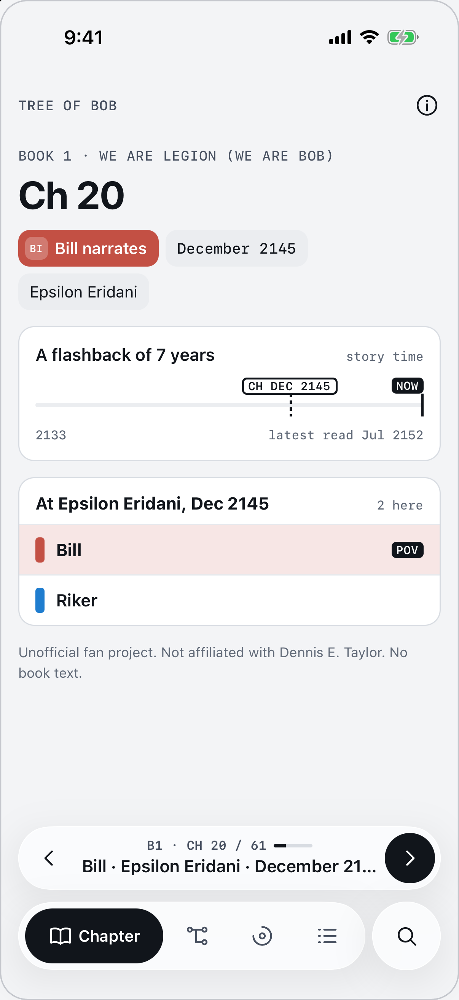
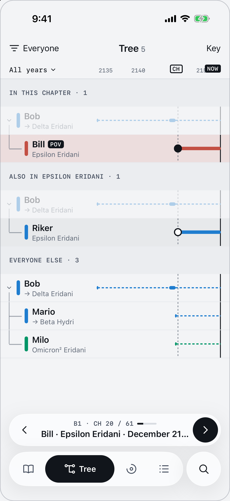
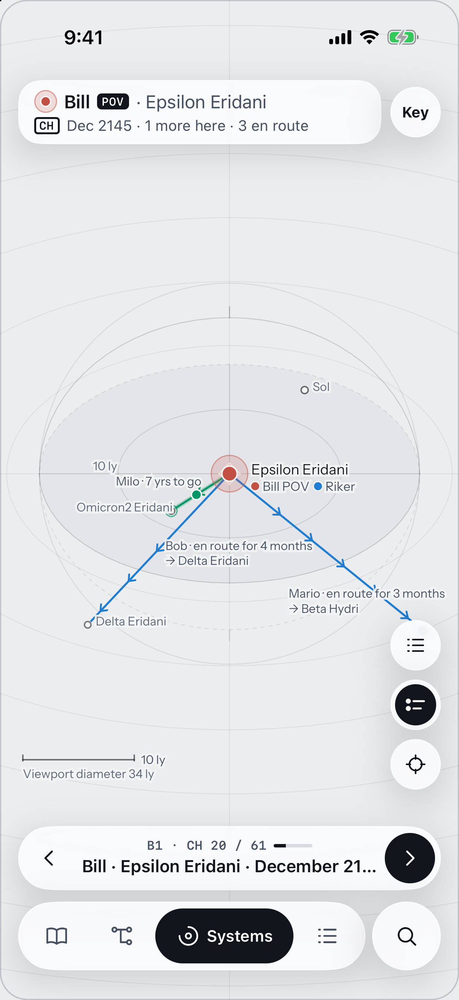
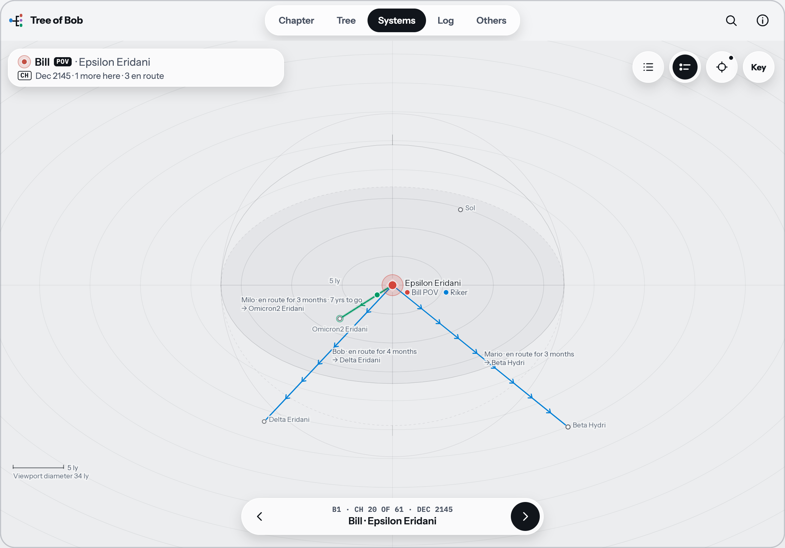
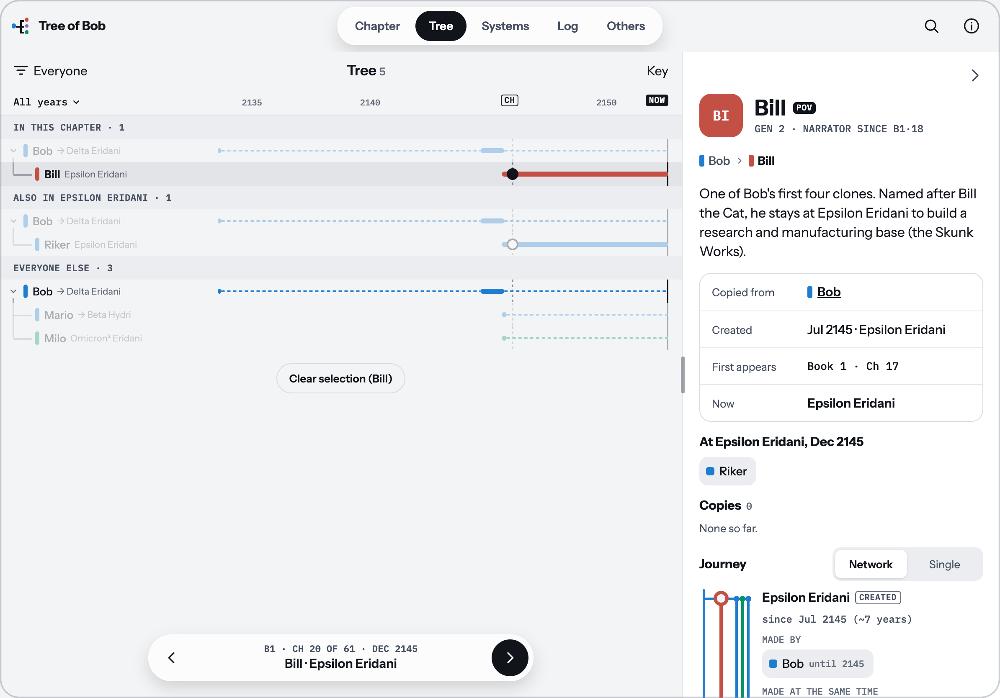

# Tree of Bob

A spoiler-free companion to Dennis E. Taylor's Bobiverse books.

<p align="center">
  
  &nbsp;
  
  &nbsp;
  
</p>
<p align="center">
  
  &nbsp;
  
</p>
<h3 align="center"><a href="https://prompt-janitor.github.io/tree-of-bob/">prompt-janitor.github.io/tree-of-bob</a></h3>

## Add it to your Home Screen

Once added, it opens full screen like an app and works offline.

- **iPhone or iPad (Safari):** tap the Share button, then **Add to Home Screen**. On iPhone, if you can't see Share,
  tap **⋯** first.
- **Android, or Chrome or Edge on a computer:** tap the install icon in the app, or open the browser menu and choose
  **Install app**.

## Using it

1. Tap the chapter bar at the bottom and pick your book and the chapter you are **about to read**.
2. Browse the tabs:
   - **Chapter:** who narrates, when and where, and who is nearby.
   - **Tree:** the family tree of Bob's copies.
   - **Systems:** a 3D star map of where everyone is and how they got there.
   - **Log:** what has happened so far, in story order.
   - **Others** (tablet and computer; on a phone, use Search): the other replicants and AIs you have met.
3. Tap a Bob to see his details, or use Search to find anyone you have met. Use the arrows on the chapter bar to move forward as you read.

## Spoiler warning for this repository

The app hides what you haven't read, but the files in this repository do not. **The data file
`src/data/tree-of-bob.json` and the tests cover all six books.** Don't browse the source if you haven't finished the
series.

## Corrections

Spotted a mistake? Open an issue at <https://github.com/prompt-janitor/tree-of-bob/issues> with the book, chapter
and a source. Keep spoilers out of the issue title.

## Disclaimer

Unofficial fan project. Not affiliated with [Dennis E. Taylor](http://dennisetaylor.org/) or his publishers. It
contains no text from the books. It collects no data.

AI-generated. May contain errors. Provided as is, without warranty or liability.

## For developers

Requires Node.js 22 or later.

```bash
npm ci
npx expo start        # i for the iOS simulator, w for web
npm test
npm run typecheck
npm run lint
npm run build:web     # static web build (PWA) in dist/
```

Pushing to `main` deploys the web app to GitHub Pages.

## Licences

- Code: MIT, see [`LICENSE`](LICENSE).
- Data file: CC BY-SA 4.0, see [`LICENSE-DATA`](LICENSE-DATA). Adapted in part from the
  [Bobiverse Wiki](https://bobiverse.fandom.com) (CC BY-SA 3.0). Star positions from the
  [HYG Database v4.1](https://codeberg.org/astronexus/hyg) (CC BY-SA 4.0); some far positions from SIMBAD and
  Wikipedia.
- Fonts: Instrument Sans and IBM Plex Mono, SIL Open Font License 1.1.
- App icon: not licensed for reuse.
- Packages: listed in the app under About, Credits & licences.
